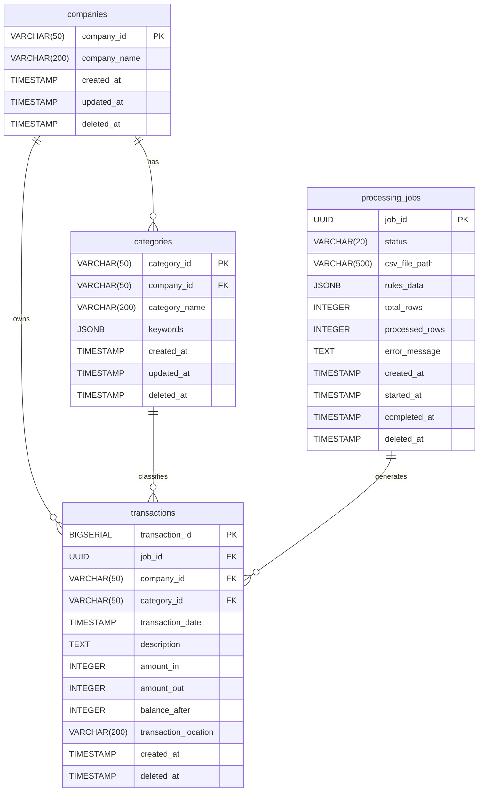

# DB 스키마 설계 문서

## 1. 테이블 설계

- `거래 내역`을 규칙에 기반해 `분류(카테고리)`하고 `사업체`별 검색 API를 제공할 수 있어야 합니다.
- API 서버에서 파일(csv, json)을 저장하면 프로세스 서버에게 `분류 작업`을 전달합니다.

위 핵심 요구사항을 바탕으로 필요한 데이터는 다음과 같이 정의할 수 있습니다.

- 사업체 (companies)
- 분류 (categories)
- 분류 작업 (processing_job)
- 거래 내역 (transaction)

각 데이터는 다음과 같은 관계를 가집니다.

- companies ↔ categories: 1:N (한 회사는 여러 카테고리를 가짐)
- companies ↔ transactions: 1:N (한 회사는 여러 거래내역을 가짐)
- categories ↔ transactions: 1:N (한 카테고리는 여러 거래에 사용됨)
- processing_jobs ↔ transactions: 1:N (한 작업은 여러 거래를 생성함)

즉, ERD는 다음과 같이 표현할 수 있습니다.

---

## 2. ERD (Entity Relationship Diagram)



---

## 3. DDL

- #### 사업체 테이블 (companies)
    - company_name : 사업체 명

```sql
CREATE TABLE companies
(
    company_id   VARCHAR(50) PRIMARY KEY,
    company_name VARCHAR(200) NOT NULL,
    created_at   TIMESTAMP DEFAULT CURRENT_TIMESTAMP,
    updated_at   TIMESTAMP DEFAULT CURRENT_TIMESTAMP,
    deleted_at   TIMESTAMP DEFAULT NULL
);
```

<br/>

- #### 분류(카테고리) 테이블 (categories)
    - company_id : 사업체
    - category_name : 분류 명
    - keywords : 분류 키워드

```sql
CREATE TABLE categories
(
    category_id   VARCHAR(50) PRIMARY KEY,
    company_id    VARCHAR(50)  NOT NULL REFERENCES companies (company_id) ON DELETE CASCADE,
    category_name VARCHAR(200) NOT NULL,
    keywords      JSONB        NOT NULL DEFAULT '[]',
    created_at    TIMESTAMP             DEFAULT CURRENT_TIMESTAMP,
    updated_at    TIMESTAMP             DEFAULT CURRENT_TIMESTAMP,
    deleted_at    TIMESTAMP             DEFAULT NULL
);
```

<br/>

- #### 분류 작업 테이블 (processing_jobs)
    - status : 작업 상태 (`pending`, `processing`, `completed`, `failed`)
    - rules_data : JSON 규칙
    - total_rows : csv의 총 거래 내역 수
    - processed_rows : 처리가 완료된 거래 내역 수 (1000개 단위 플래그)
    - error_message : 처리 중 에러 발생 로깅

```sql
CREATE EXTENSION IF NOT EXISTS "uuid-ossp";

CREATE TABLE processing_jobs
(
    job_id         UUID PRIMARY KEY     DEFAULT uuid_generate_v4(),
    status         VARCHAR(20) NOT NULL DEFAULT 'pending'
        CHECK (status IN ('pending', 'processing', 'completed', 'failed')),
    csv_file_path  VARCHAR(500),
    rules_data     JSONB,
    total_rows     INTEGER              DEFAULT 0,
    processed_rows INTEGER              DEFAULT 0,
    error_message  TEXT,
    created_at     TIMESTAMP            DEFAULT CURRENT_TIMESTAMP,
    started_at     TIMESTAMP,
    completed_at   TIMESTAMP,
    deleted_at     TIMESTAMP            DEFAULT NULL
);
```

<br/>

- #### 거래 내역 테이블 (transactions)
    - job_id : 거래 내역 생성 작업 추적 용 참조 키
    - company_id : 거래 내역 사업체
    - transaction_date : 거래 내역 일자
    - dscription : 적요
    - amount_in, amount_out : 입/출금
    - transaction_location : 거래 사업체(장소)

```sql
CREATE TABLE transactions
(
    transaction_id       BIGSERIAL PRIMARY KEY,
    job_id               UUID        NOT NULL REFERENCES processing_jobs (job_id) ON DELETE CASCADE,
    company_id           VARCHAR(50) REFERENCES companies (company_id) ON DELETE SET NULL,
    category_id          VARCHAR(50) REFERENCES categories (category_id) ON DELETE SET NULL,
    transaction_date     TIMESTAMP   NOT NULL,
    description          TEXT        NOT NULL,
    amount_in            INTEGER   DEFAULT 0,
    amount_out           INTEGER   DEFAULT 0,
    balance_after        INTEGER     NOT NULL,
    transaction_location VARCHAR(200),
    created_at           TIMESTAMP DEFAULT CURRENT_TIMESTAMP,
    deleted_at           TIMESTAMP DEFAULT NULL
);
```
